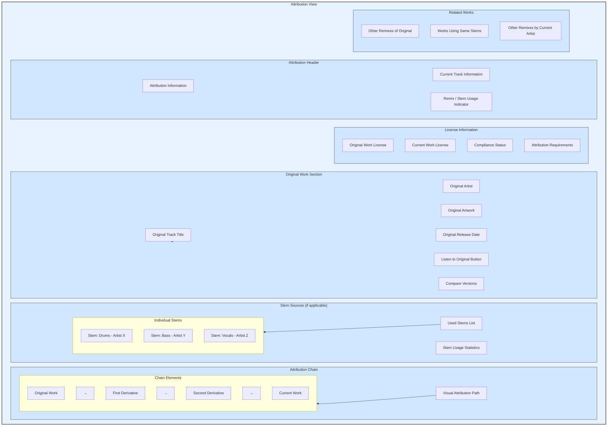

# Attribution View Blueprint

The attribution view displays the relationship between a remix or stem-based work and its original sources, ensuring proper credit and linking.

```mermaid
graph TD
    subgraph AttributionView["Attribution View"]
        subgraph HeaderSection["Attribution Header"]
            Title["Attribution Information"]
            CurrentTrack["Current Track Information"]
            AttributionType["Remix / Stem Usage Indicator"]
        end
        
        subgraph OriginalWork["Original Work Section"]
            OriginalTitle["Original Track Title"]
            OriginalArtist["Original Artist"]
            OriginalCover["Original Artwork"]
            OriginalDate["Original Release Date"]
            ListenOriginal["Listen to Original Button"]
            CompareButton["Compare Versions"]
        end
        
        subgraph StemSources["Stem Sources (if applicable)"]
            StemList["Used Stems List"]
            subgraph StemEntries["Individual Stems"]
                Stem1["Stem: Drums - Artist X"]
                Stem2["Stem: Bass - Artist Y"]
                Stem3["Stem: Vocals - Artist Z"]
            end
            StemStats["Stem Usage Statistics"]
        end
        
        subgraph AttributionChain["Attribution Chain"]
            ChainVisual["Visual Attribution Path"]
            subgraph ChainElements["Chain Elements"]
                Original["Original Work"]
                Arrow1["→"]
                FirstDerivative["First Derivative"]
                Arrow2["→"]
                SecondDerivative["Second Derivative"]
                Arrow3["→"]
                CurrentWork["Current Work"]
            end
        end
        
        subgraph LicenseInfo["License Information"]
            OriginalLicense["Original Work License"]
            DerivativeLicense["Current Work License"]
            LicenseCompliance["Compliance Status"]
            Attribution["Attribution Requirements"]
        end
        
        subgraph RelatedWorks["Related Works"]
            OtherRemixes["Other Remixes of Original"]
            SameStemWorks["Works Using Same Stems"]
            ArtistRemixes["Other Remixes by Current Artist"]
        end
    end
    
    HeaderSection --> CurrentTrack
    HeaderSection --> AttributionType
    
    OriginalWork --> OriginalTitle
    OriginalWork --> OriginalArtist
    OriginalWork --> OriginalCover
    OriginalWork --> OriginalDate
    OriginalWork --> ListenOriginal
    OriginalWork --> CompareButton
    
    StemSources --> StemList
    StemList --> StemEntries
    StemSources --> StemStats
    
    AttributionChain --> ChainVisual
    ChainVisual --> ChainElements
    
    style AttributionView fill:#e6f3ff,stroke:#333,stroke-width:2px
    style HeaderSection fill:#d1e7ff,stroke:#333,stroke-width:1px
    style OriginalWork fill:#d1e7ff,stroke:#333,stroke-width:1px
    style StemSources fill:#d1e7ff,stroke:#333,stroke-width:1px
    style AttributionChain fill:#d1e7ff,stroke:#333,stroke-width:1px
    style LicenseInfo fill:#d1e7ff,stroke:#333,stroke-width:1px
    style RelatedWorks fill:#d1e7ff,stroke:#333,stroke-width:1px
```
