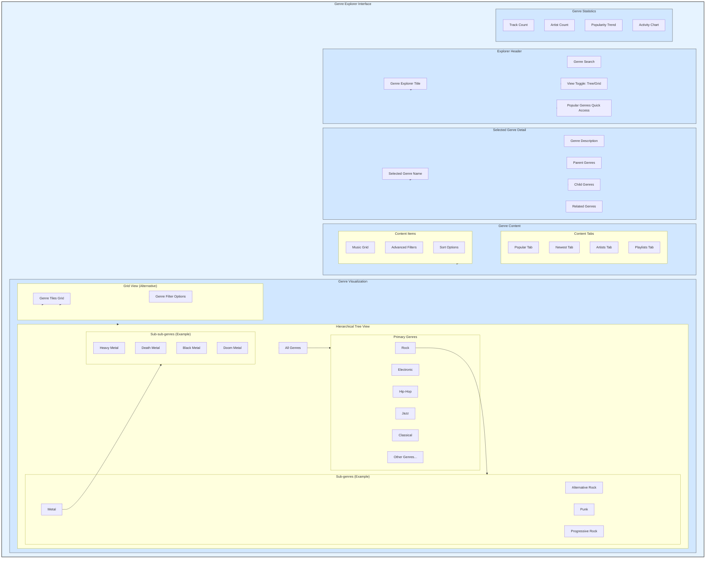

# Genre Explorer Blueprint

The genre explorer provides a hierarchical navigation system for browsing music by genre and subgenre.

```mermaid
graph TD
    subgraph GenreExplorer["Genre Explorer Interface"]
        subgraph ExplorerHeader["Explorer Header"]
            Title["Genre Explorer Title"]
            SearchBar["Genre Search"]
            ViewToggle["View Toggle: Tree/Grid"]
            PopularGenres["Popular Genres Quick Access"]
        end
        
        subgraph GenreVisualization["Genre Visualization"]
            subgraph TreeView["Hierarchical Tree View"]
                GenreRoot["All Genres"]
                subgraph PrimaryGenres["Primary Genres"]
                    Rock["Rock"]
                    Electronic["Electronic"]
                    HipHop["Hip-Hop"]
                    Jazz["Jazz"]
                    Classical["Classical"]
                    Other["Other Genres..."]
                end
                
                subgraph Subgenres["Sub-genres (Example)"]
                    RockSub1["Alternative Rock"]
                    RockSub2["Metal"]
                    RockSub3["Punk"]
                    RockSub4["Progressive Rock"]
                end
                
                subgraph SubSubgenres["Sub-sub-genres (Example)"]
                    Metal1["Heavy Metal"]
                    Metal2["Death Metal"]
                    Metal3["Black Metal"]
                    Metal4["Doom Metal"]
                end
            end
            
            subgraph GridView["Grid View (Alternative)"]
                GenreTiles["Genre Tiles Grid"]
                GenreFilters["Genre Filter Options"]
            end
        end
        
        subgraph GenreDetail["Selected Genre Detail"]
            GenreName["Selected Genre Name"]
            GenreDescription["Genre Description"]
            ParentGenres["Parent Genres"]
            ChildGenres["Child Genres"]
            RelatedGenres["Related Genres"]
        end
        
        subgraph GenreContent["Genre Content"]
            subgraph ContentTabs["Content Tabs"]
                PopularTab["Popular Tab"]
                NewestTab["Newest Tab"]
                ArtistsTab["Artists Tab"]
                PlaylistsTab["Playlists Tab"]
            end
            
            subgraph ContentItems["Content Items"]
                ContentGrid["Music Grid"]
                ContentFilters["Advanced Filters"]
                SortOptions["Sort Options"]
            end
        end
        
        subgraph GenreStats["Genre Statistics"]
            TrackCount["Track Count"]
            ArtistCount["Artist Count"]
            Popularity["Popularity Trend"]
            ActivityChart["Activity Chart"]
        end
    end
    
    ExplorerHeader --> Title
    ExplorerHeader --> SearchBar
    ExplorerHeader --> ViewToggle
    ExplorerHeader --> PopularGenres
    
    GenreVisualization --> TreeView
    TreeView --> GenreRoot
    GenreRoot --> PrimaryGenres
    Rock --> Subgenres
    RockSub2 --> SubSubgenres
    
    GenreVisualization --> GridView
    GridView --> GenreTiles
    GridView --> GenreFilters
    
    GenreDetail --> GenreName
    GenreDetail --> GenreDescription
    GenreDetail --> ParentGenres
    GenreDetail --> ChildGenres
    GenreDetail --> RelatedGenres
    
    GenreContent --> ContentTabs
    GenreContent --> ContentItems
    
    style GenreExplorer fill:#e6f3ff,stroke:#333,stroke-width:2px
    style ExplorerHeader fill:#d1e7ff,stroke:#333,stroke-width:1px
    style GenreVisualization fill:#d1e7ff,stroke:#333,stroke-width:1px
    style GenreDetail fill:#d1e7ff,stroke:#333,stroke-width:1px
    style GenreContent fill:#d1e7ff,stroke:#333,stroke-width:1px
    style GenreStats fill:#d1e7ff,stroke:#333,stroke-width:1px
```
