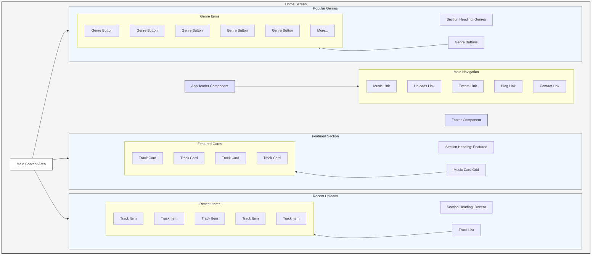

# Home Screen Blueprint

The home screen serves as the entry point to the application, showcasing featured music, recent uploads, and navigation options.

```mermaid
graph TD
    subgraph HomeScreen["Home Screen"]
        Header["AppHeader Component"]
        MainContent["Main Content Area"]
        Footer["Footer Component"]
        
        subgraph MainNavigation["Main Navigation"]
            NavMusic["Music Link"]
            NavUploads["Uploads Link"]
            NavEvents["Events Link"]
            NavBlog["Blog Link"]
            NavContact["Contact Link"]
        end
        
        subgraph FeaturedSection["Featured Section"]
            FeaturedTitle["Section Heading: Featured"]
            MusicCards["Music Card Grid"]
            subgraph FeaturedCards["Featured Cards"]
                Card1["Track Card"]
                Card2["Track Card"]
                Card3["Track Card"]
                Card4["Track Card"]
            end
        end
        
        subgraph RecentSection["Recent Uploads"]
            RecentTitle["Section Heading: Recent"]
            RecentList["Track List"]
            subgraph RecentItems["Recent Items"]
                Recent1["Track Item"]
                Recent2["Track Item"]
                Recent3["Track Item"]
                Recent4["Track Item"]
                Recent5["Track Item"]
            end
        end
        
        subgraph PopularSection["Popular Genres"]
            GenresTitle["Section Heading: Genres"]
            GenresList["Genre Buttons"]
            subgraph GenreItems["Genre Items"]
                Genre1["Genre Button"]
                Genre2["Genre Button"]
                Genre3["Genre Button"]
                Genre4["Genre Button"]
                Genre5["Genre Button"]
                MoreGenres["More..."]
            end
        end
    end
    
    Header --> MainNavigation
    MainContent --> FeaturedSection
    MainContent --> RecentSection
    MainContent --> PopularSection
    FeaturedSection --> FeaturedTitle
    FeaturedSection --> MusicCards
    MusicCards --> FeaturedCards
    RecentSection --> RecentTitle
    RecentSection --> RecentList
    RecentList --> RecentItems
    PopularSection --> GenresTitle
    PopularSection --> GenresList
    GenresList --> GenreItems
    
    style HomeScreen fill:#f5f5f5,stroke:#333,stroke-width:2px
    style Header fill:#e0e0ff,stroke:#333,stroke-width:1px
    style MainContent fill:#ffffff,stroke:#333,stroke-width:1px
    style Footer fill:#e0e0ff,stroke:#333,stroke-width:1px
    style FeaturedSection fill:#f0f8ff,stroke:#333,stroke-width:1px
    style RecentSection fill:#f0f8ff,stroke:#333,stroke-width:1px
    style PopularSection fill:#f0f8ff,stroke:#333,stroke-width:1px
```
