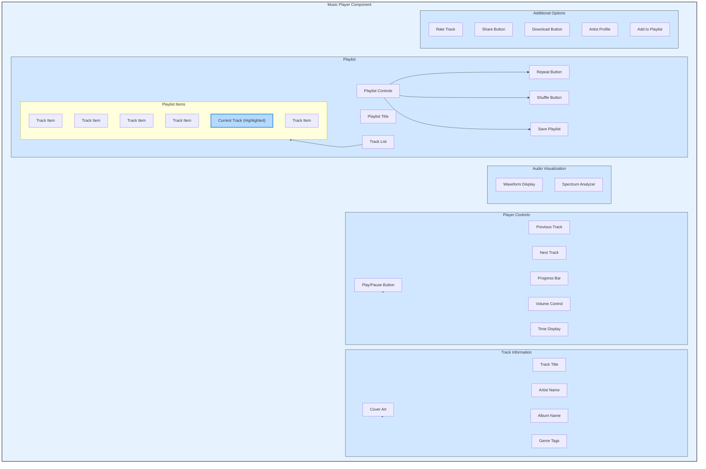

# Music Player Blueprint

The music player provides audio playback capabilities with playlist management, visualizations, and track information.

```mermaid
graph TD
    subgraph MusicPlayer["Music Player Component"]
        subgraph PlayerControls["Player Controls"]
            PlayPause["Play/Pause Button"]
            Prev["Previous Track"]
            Next["Next Track"]
            Progress["Progress Bar"]
            Volume["Volume Control"]
            TimeDisplay["Time Display"]
        end
        
        subgraph TrackInfo["Track Information"]
            CoverArt["Cover Art"]
            TrackTitle["Track Title"]
            ArtistName["Artist Name"]
            AlbumName["Album Name"]
            GenreTags["Genre Tags"]
        end
        
        subgraph Visualization["Audio Visualization"]
            Waveform["Waveform Display"]
            SpectrumAnalyzer["Spectrum Analyzer"]
        end
        
        subgraph PlaylistSection["Playlist"]
            PlaylistTitle["Playlist Title"]
            TrackList["Track List"]
            subgraph PlaylistItems["Playlist Items"]
                Track1["Track Item"]
                Track2["Track Item"] 
                Track3["Track Item"]
                Track4["Track Item"]
                CurrentTrack["Current Track (Highlighted)"]
                Track5["Track Item"]
            end
            PlaylistControls["Playlist Controls"]
            RepeatMode["Repeat Button"]
            ShuffleMode["Shuffle Button"]
            SavePlaylist["Save Playlist"]
        end
        
        subgraph AdditionalOptions["Additional Options"]
            RateTrack["Rate Track"]
            Share["Share Button"]
            Download["Download Button"]
            ViewProfile["Artist Profile"]
            AddToPlaylist["Add to Playlist"]
        end
    end
    
    PlayerControls --> PlayPause
    PlayerControls --> Prev
    PlayerControls --> Next
    PlayerControls --> Progress
    PlayerControls --> Volume
    PlayerControls --> TimeDisplay
    
    TrackInfo --> CoverArt
    TrackInfo --> TrackTitle
    TrackInfo --> ArtistName
    TrackInfo --> AlbumName
    TrackInfo --> GenreTags
    
    PlaylistSection --> PlaylistTitle
    PlaylistSection --> TrackList
    TrackList --> PlaylistItems
    PlaylistSection --> PlaylistControls
    PlaylistControls --> RepeatMode
    PlaylistControls --> ShuffleMode
    PlaylistControls --> SavePlaylist
    
    style MusicPlayer fill:#e6f3ff,stroke:#333,stroke-width:2px
    style PlayerControls fill:#d1e7ff,stroke:#333,stroke-width:1px
    style TrackInfo fill:#d1e7ff,stroke:#333,stroke-width:1px
    style Visualization fill:#d1e7ff,stroke:#333,stroke-width:1px
    style PlaylistSection fill:#d1e7ff,stroke:#333,stroke-width:1px
    style AdditionalOptions fill:#d1e7ff,stroke:#333,stroke-width:1px
    style CurrentTrack fill:#b3d9ff,stroke:#0066cc,stroke-width:2px
```
