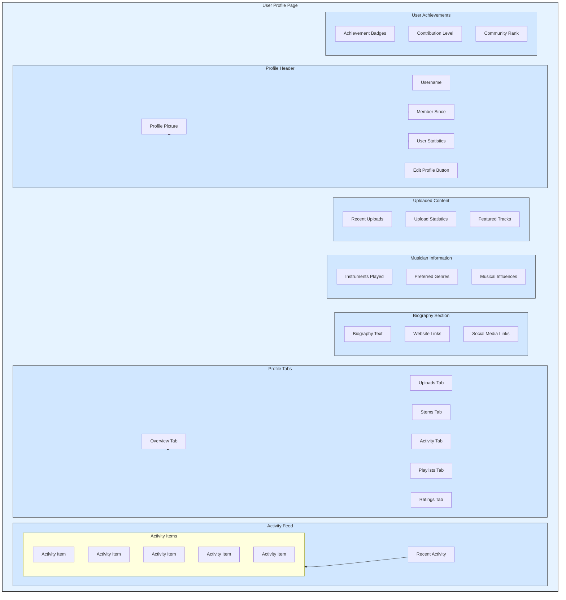

# User Profile Blueprint

The user profile page displays information about the user, their uploaded content, and activity history.

```mermaid
graph TD
    subgraph ProfilePage["User Profile Page"]
        subgraph ProfileHeader["Profile Header"]
            Avatar["Profile Picture"]
            Username["Username"]
            MemberSince["Member Since"]
            Stats["User Statistics"]
            EditProfile["Edit Profile Button"]
        end
        
        subgraph ProfileTabs["Profile Tabs"]
            Overview["Overview Tab"]
            Uploads["Uploads Tab"]
            Stems["Stems Tab"]
            Activity["Activity Tab"]
            Playlists["Playlists Tab"]
            Ratings["Ratings Tab"]
        end
        
        subgraph BiographySection["Biography Section"]
            Bio["Biography Text"]
            WebsiteLinks["Website Links"]
            SocialLinks["Social Media Links"]
        end
        
        subgraph MusicianInfo["Musician Information"]
            Instruments["Instruments Played"]
            Genres["Preferred Genres"]
            InfluencesSection["Musical Influences"]
        end
        
        subgraph UploadedContent["Uploaded Content"]
            RecentUploads["Recent Uploads"]
            UploadStats["Upload Statistics"]
            FeaturedTracks["Featured Tracks"]
        end
        
        subgraph ActivityFeed["Activity Feed"]
            RecentActivity["Recent Activity"]
            subgraph ActivityItems["Activity Items"]
                Activity1["Activity Item"]
                Activity2["Activity Item"]
                Activity3["Activity Item"]
                Activity4["Activity Item"]
                Activity5["Activity Item"]
            end
        end
        
        subgraph Achievements["User Achievements"]
            Badges["Achievement Badges"]
            ContributionLevel["Contribution Level"]
            CommunityRank["Community Rank"]
        end
    end
    
    ProfileHeader --> Avatar
    ProfileHeader --> Username
    ProfileHeader --> MemberSince
    ProfileHeader --> Stats
    ProfileHeader --> EditProfile
    
    ProfileTabs --> Overview
    ProfileTabs --> Uploads
    ProfileTabs --> Stems
    ProfileTabs --> Activity
    ProfileTabs --> Playlists
    ProfileTabs --> Ratings
    
    ActivityFeed --> RecentActivity
    RecentActivity --> ActivityItems
    
    style ProfilePage fill:#e6f3ff,stroke:#333,stroke-width:2px
    style ProfileHeader fill:#d1e7ff,stroke:#333,stroke-width:1px
    style ProfileTabs fill:#d1e7ff,stroke:#333,stroke-width:1px
    style BiographySection fill:#d1e7ff,stroke:#333,stroke-width:1px
    style MusicianInfo fill:#d1e7ff,stroke:#333,stroke-width:1px
    style UploadedContent fill:#d1e7ff,stroke:#333,stroke-width:1px
    style ActivityFeed fill:#d1e7ff,stroke:#333,stroke-width:1px
    style Achievements fill:#d1e7ff,stroke:#333,stroke-width:1px
```
