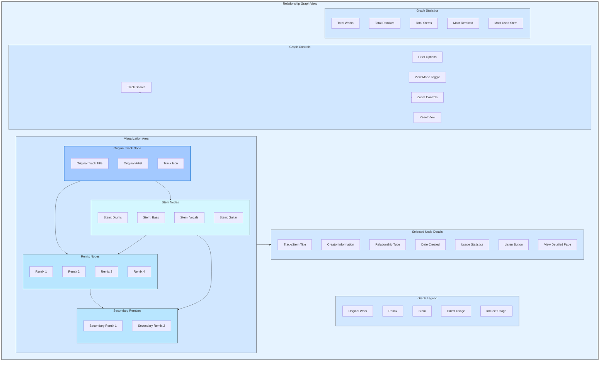

# Relationship Graph Blueprint

The relationship graph visualizes the connections between original works, remixes, and stem usage across the platform.

```mermaid
graph TD
    subgraph RelationshipGraph["Relationship Graph View"]
        subgraph GraphControls["Graph Controls"]
            SearchTrack["Track Search"]
            FilterOptions["Filter Options"]
            ViewToggle["View Mode Toggle"]
            ZoomControls["Zoom Controls"]
            ResetView["Reset View"]
        end
        
        subgraph GraphVisualization["Visualization Area"]
            subgraph OriginalNode["Original Track Node"]
                OriginalTitle["Original Track Title"]
                OriginalArtist["Original Artist"]
                OriginalIcon["Track Icon"]
            end
            
            subgraph RemixNodes["Remix Nodes"]
                Remix1["Remix 1"]
                Remix2["Remix 2"]
                Remix3["Remix 3"]
                Remix4["Remix 4"]
            end
            
            subgraph StemNodes["Stem Nodes"]
                Stem1["Stem: Drums"]
                Stem2["Stem: Bass"]
                Stem3["Stem: Vocals"]
                Stem4["Stem: Guitar"]
            end
            
            subgraph SecondaryRemixes["Secondary Remixes"]
                SecondRemix1["Secondary Remix 1"]
                SecondRemix2["Secondary Remix 2"]
            end
            
            OriginalNode --> RemixNodes
            OriginalNode --> StemNodes
            RemixNodes --> SecondaryRemixes
            StemNodes --> RemixNodes
            StemNodes --> SecondaryRemixes
        end
        
        subgraph NodeDetails["Selected Node Details"]
            SelectedTitle["Track/Stem Title"]
            CreatorInfo["Creator Information"]
            RelationshipType["Relationship Type"]
            DateCreated["Date Created"]
            UsageStats["Usage Statistics"]
            ListenButton["Listen Button"]
            ViewDetailed["View Detailed Page"]
        end
        
        subgraph LegendSection["Graph Legend"]
            OriginalWorkLegend["Original Work"]
            RemixLegend["Remix"]
            StemLegend["Stem"]
            DirectUsageLegend["Direct Usage"]
            IndirectUsageLegend["Indirect Usage"]
        end
        
        subgraph GraphStats["Graph Statistics"]
            TotalWorks["Total Works"]
            TotalRemixes["Total Remixes"]
            TotalStems["Total Stems"]
            MostRemixed["Most Remixed"]
            MostUsedStem["Most Used Stem"]
        end
    end
    
    GraphControls --> SearchTrack
    GraphControls --> FilterOptions
    GraphControls --> ViewToggle
    GraphControls --> ZoomControls
    GraphControls --> ResetView
    
    GraphVisualization --> NodeDetails
    
    style RelationshipGraph fill:#e6f3ff,stroke:#333,stroke-width:2px
    style GraphControls fill:#d1e7ff,stroke:#333,stroke-width:1px
    style GraphVisualization fill:#d1e7ff,stroke:#333,stroke-width:1px
    style NodeDetails fill:#d1e7ff,stroke:#333,stroke-width:1px
    style LegendSection fill:#d1e7ff,stroke:#333,stroke-width:1px
    style GraphStats fill:#d1e7ff,stroke:#333,stroke-width:1px
    style OriginalNode fill:#a3c9ff,stroke:#0066cc,stroke-width:2px
    style RemixNodes fill:#b8e6ff,stroke:#333,stroke-width:1px
    style StemNodes fill:#d4f7ff,stroke:#333,stroke-width:1px
    style SecondaryRemixes fill:#b8e6ff,stroke:#333,stroke-width:1px
```
