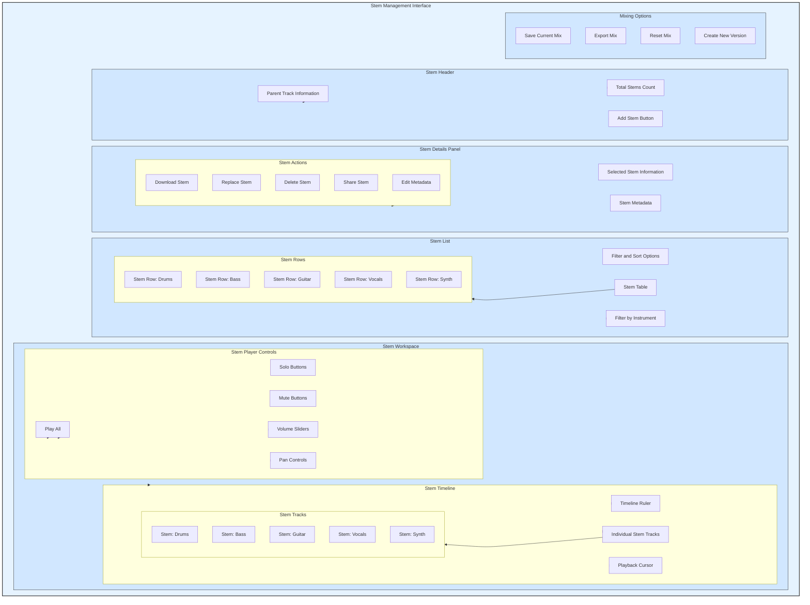

# Stem Management Blueprint

The stem management interface allows users to view, upload, and manage stems for collaborative music creation.

```mermaid
graph TD
    subgraph StemManagement["Stem Management Interface"]
        subgraph StemHeader["Stem Header"]
            ParentTrack["Parent Track Information"]
            StemCount["Total Stems Count"]
            AddStemButton["Add Stem Button"]
        end
        
        subgraph StemWorkspace["Stem Workspace"]
            subgraph StemTimeline["Stem Timeline"]
                TimelineRuler["Timeline Ruler"]
                TrackRows["Individual Stem Tracks"]
                subgraph StemTracks["Stem Tracks"]
                    Stem1["Stem: Drums"]
                    Stem2["Stem: Bass"]
                    Stem3["Stem: Guitar"]
                    Stem4["Stem: Vocals"]
                    Stem5["Stem: Synth"]
                end
                PlaybackCursor["Playback Cursor"]
            end
            
            subgraph StemPlayer["Stem Player Controls"]
                PlayAllButton["Play All"]
                SoloButtons["Solo Buttons"]
                MuteButtons["Mute Buttons"]
                VolumeSliders["Volume Sliders"]
                PanControls["Pan Controls"]
            end
        end
        
        subgraph StemDetails["Stem Details Panel"]
            StemInfo["Selected Stem Information"]
            StemMeta["Stem Metadata"]
            subgraph StemActions["Stem Actions"]
                DownloadStem["Download Stem"]
                ReplaceStem["Replace Stem"]
                DeleteStem["Delete Stem"]
                ShareStem["Share Stem"]
                EditMetadata["Edit Metadata"]
            end
        end
        
        subgraph StemList["Stem List"]
            StemFilterSort["Filter and Sort Options"]
            StemTable["Stem Table"]
            subgraph StemTableRows["Stem Rows"]
                StemRow1["Stem Row: Drums"]
                StemRow2["Stem Row: Bass"]
                StemRow3["Stem Row: Guitar"]
                StemRow4["Stem Row: Vocals"]
                StemRow5["Stem Row: Synth"]
            end
            InstrumentFilter["Filter by Instrument"]
        end
        
        subgraph MixingOptions["Mixing Options"]
            SaveMix["Save Current Mix"]
            ExportMix["Export Mix"]
            ResetMix["Reset Mix"]
            CreateVersion["Create New Version"]
        end
    end
    
    StemHeader --> ParentTrack
    StemHeader --> StemCount
    StemHeader --> AddStemButton
    
    StemWorkspace --> StemTimeline
    StemTimeline --> TimelineRuler
    StemTimeline --> TrackRows
    TrackRows --> StemTracks
    StemTimeline --> PlaybackCursor
    
    StemWorkspace --> StemPlayer
    StemPlayer --> PlayAllButton
    StemPlayer --> SoloButtons
    StemPlayer --> MuteButtons
    StemPlayer --> VolumeSliders
    StemPlayer --> PanControls
    
    StemDetails --> StemInfo
    StemDetails --> StemMeta
    StemDetails --> StemActions
    
    StemList --> StemFilterSort
    StemList --> StemTable
    StemTable --> StemTableRows
    StemList --> InstrumentFilter
    
    style StemManagement fill:#e6f3ff,stroke:#333,stroke-width:2px
    style StemHeader fill:#d1e7ff,stroke:#333,stroke-width:1px
    style StemWorkspace fill:#d1e7ff,stroke:#333,stroke-width:1px
    style StemDetails fill:#d1e7ff,stroke:#333,stroke-width:1px
    style StemList fill:#d1e7ff,stroke:#333,stroke-width:1px
    style MixingOptions fill:#d1e7ff,stroke:#333,stroke-width:1px
```
