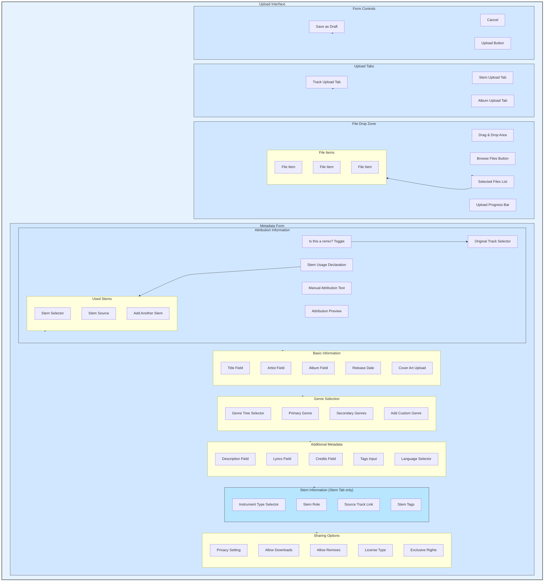

# Upload Interface Blueprint

The upload interface provides functionality for users to upload music tracks and stems with comprehensive metadata.

```mermaid
graph TD
    subgraph UploadInterface["Upload Interface"]
        subgraph UploadTabs["Upload Tabs"]
            TrackTab["Track Upload Tab"]
            StemTab["Stem Upload Tab"]
            AlbumTab["Album Upload Tab"]
        end
        
        subgraph DropZone["File Drop Zone"]
            DropArea["Drag & Drop Area"]
            BrowseButton["Browse Files Button"]
            SelectedFiles["Selected Files List"]
            subgraph FileList["File Items"]
                File1["File Item"]
                File2["File Item"]
                File3["File Item"]
            end
            UploadProgress["Upload Progress Bar"]
        end
        
        subgraph MetadataForm["Metadata Form"]
            subgraph BasicInfo["Basic Information"]
                TitleField["Title Field"]
                ArtistField["Artist Field"]
                AlbumField["Album Field"]
                ReleaseDate["Release Date"]
                CoverArtUpload["Cover Art Upload"]
            end
            
            subgraph GenreSection["Genre Selection"]
                GenreTree["Genre Tree Selector"]
                PrimaryGenre["Primary Genre"]
                SecondaryGenres["Secondary Genres"]
                CustomGenre["Add Custom Genre"]
            end
            
            subgraph AdditionalMeta["Additional Metadata"]
                Description["Description Field"]
                Lyrics["Lyrics Field"]
                Credits["Credits Field"]
                Tags["Tags Input"]
                Language["Language Selector"]
            end
            
            subgraph StemInfo["Stem Information (Stem Tab only)"]
                InstrumentType["Instrument Type Selector"]
                StemRole["Stem Role"]
                SourceTrack["Source Track Link"]
                StemTags["Stem Tags"]
            end
            
            subgraph SharingOptions["Sharing Options"]
                Visibility["Privacy Setting"]
                AllowDownload["Allow Downloads"]
                AllowRemix["Allow Remixes"]
                License["License Type"]
                ExclusiveRights["Exclusive Rights"]
            end
            
            subgraph AttributionInfo["Attribution Information"]
                IsRemixToggle["Is this a remix? Toggle"]
                OriginalTrackSelector["Original Track Selector"]
                StemUsageSection["Stem Usage Declaration"]
                subgraph UsedStems["Used Stems"]
                    StemSelector["Stem Selector"]
                    StemSource["Stem Source"]
                    AddStemButton["Add Another Stem"]
                end
                ManualAttribution["Manual Attribution Text"]
                AttributionPreview["Attribution Preview"]
            end
        end
        
        subgraph FormControls["Form Controls"]
            SaveDraft["Save as Draft"]
            CancelButton["Cancel"]
            SubmitButton["Upload Button"]
        end
    end
    
    UploadTabs --> TrackTab
    UploadTabs --> StemTab
    UploadTabs --> AlbumTab
    
    DropZone --> DropArea
    DropZone --> BrowseButton
    DropZone --> SelectedFiles
    SelectedFiles --> FileList
    DropZone --> UploadProgress
    
    MetadataForm --> BasicInfo
    MetadataForm --> GenreSection
    MetadataForm --> AdditionalMeta
    MetadataForm --> StemInfo
    MetadataForm --> SharingOptions
    MetadataForm --> AttributionInfo
    
    AttributionInfo --> IsRemixToggle
    IsRemixToggle --> OriginalTrackSelector
    AttributionInfo --> StemUsageSection
    StemUsageSection --> UsedStems
    AttributionInfo --> ManualAttribution
    AttributionInfo --> AttributionPreview
    
    FormControls --> SaveDraft
    FormControls --> CancelButton
    FormControls --> SubmitButton
    
    style UploadInterface fill:#e6f3ff,stroke:#333,stroke-width:2px
    style UploadTabs fill:#d1e7ff,stroke:#333,stroke-width:1px
    style DropZone fill:#d1e7ff,stroke:#333,stroke-width:1px
    style MetadataForm fill:#d1e7ff,stroke:#333,stroke-width:1px
    style FormControls fill:#d1e7ff,stroke:#333,stroke-width:1px
    style StemInfo fill:#b8e6ff,stroke:#333,stroke-width:1px
    style AttributionInfo fill:#d1e7ff,stroke:#333,stroke-width:1px
```
